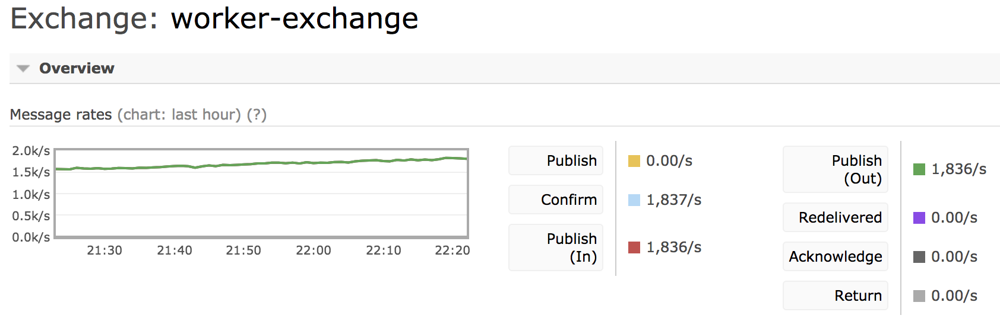

# Blackfyre

[](https://travis-ci.org/xizhibei/blackfyre)
[](http://badge.fury.io/js/blackfyre)
[](https://david-dm.org/xizhibei/blackfyre)
[](https://coveralls.io/github/xizhibei/blackfyre?branch=master)
[](https://github.com/xizhibei/blackfyre/blob/master/LICENSE)

Distributed asynchronous task queue/job queue

## Installation
```bash
npm install blackfyre --save
```

Or

```bash
yarn add blackfyre
```

## Features

- Distribution of parallel work load
- Real time operation
- Delayed job
- Priority job
- Backend store for results
- Task retry with different strategies
- Process function with pre & post hook
- Wrap function for apm

## TODO

- Redis backend store & broker
- More tests

## Overview

### Performance

In our production env:



### Basic
```ts
const consumer = new Consumer();

consumer.registerTask(<TaskMeta>{
    name: taskName,
    concurrency: 20,
}, async (data) => {
    console.log(data);
});

await (new Producer())
    .createTask(<Task>{
        name: taskName,
        body: { test: 'test' }
    });
```

### Basic
```ts
await (new Producer())
    .createTask(<Task>{
        name: taskName,
        // Delay for one hour
        eta: new Date() + 60 * 60 * 1000
        body: { test: 'test' }
    });
```

### Using newrelic in process wrap
```ts
import * as newrelic from 'newrelic';

const consumer = new Consumer(<ConsumerOptions>{
    processWrap(taskName: string, func: ProcessFunc): ProcessFunc {
        return newrelic.startBackgroundTransaction(taskName, async (data: any, task: Task) => {
            try {
                const result = await processFunc(data, task);
                return result;
            } catch (e) {
                newrelic.noticeError(e);
                throw e;
            }
        });
    }
});
```

### Using prom client moniter
```ts
const summary = new promClient.Summary({
    name: 'job_summary',
    help: 'Summary of jobs',
    percentiles: [0.5, 0.75, 0.9, 0.99, 0.999],
    labelNames: ['state', 'taskName'],
});

const consumer = new Consumer(<ConsumerOptions>{
    preProcess(task: Task) {
      // Yes, `this` binded to the process warp function,
      // so you may share some vars with the `postPostprocess`
      this.endTimer = summary.startTimer({ taskName: task.name });
    },
    postProcess(task: Task, state: TaskState, errorOrResult: any) {
      this.endTimer({ state });
    },
});
```

### Testing

```ts
  const producer = new Producer(<ProducerOptions>{
    isTestMode: true,
  });

  await producer
    .createTask(<Task>{
      name: 'example-task',
      body: { test: 'test' }
    });

console.log(producer.createdTasks[0].body);

/**
 * The output: { test: 'test' }
 */

```

More examples are in the folder `examples` or `test`

## License
MIT
